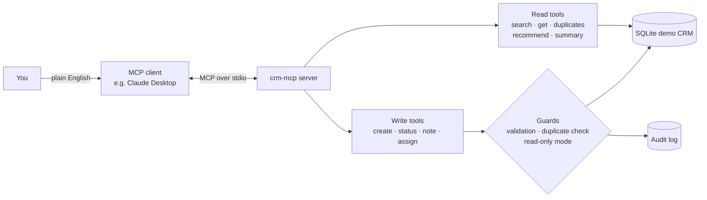

# Demo CRM MCP Server

**Let an AI assistant work a sales pipeline safely: search leads, catch duplicates before they are created, and route each lead to the right salesperson.**

This is a [Model Context Protocol (MCP)](https://modelcontextprotocol.io) server written in Python. Connect it to an MCP client such as Claude Desktop and you can manage a CRM in plain English:

> *"Show me today's new leads in Victoria, check them for duplicates, and suggest who should own each one."*

It is based on the kind of lead automation I build in production (duplicate detection, territory-based allocation, audit trails), rebuilt from scratch as an open demo with **100% fictional data**.


---

## Why this project

AI assistants are most useful when they can act on real business systems, but giving them write access to a CRM is risky. This server shows how to do it responsibly:

| Risk | How this server handles it |
|---|---|
| AI creates duplicate records | Every `create_lead` runs duplicate detection first and **refuses** high-confidence duplicates unless explicitly overridden |
| Black-box decisions | Duplicate matches and salesperson recommendations always come with **reasons** |
| Unwanted changes | Tools are labelled read-only or write, and `CRM_MCP_READ_ONLY=1` blocks every write |
| No accountability | Every change is recorded in an **audit log**, readable as an MCP resource |
| Bad input | Strict validation on every field; all SQL is parameterised |

## Architecture



## What the AI can do

**Tools**

| Tool | Type | What it does |
|---|---|---|
| `search_leads` | read | Search by name, email, phone, postcode, status, state or owner |
| `get_lead` | read | Full lead record with owner and notes |
| `find_duplicates` | read | Compares a lead with every other lead and explains each match |
| `recommend_salesperson` | read | Ranks salespeople by territory coverage and current workload |
| `pipeline_summary` | read | Counts by status and source, unassigned leads, win rate |
| `create_lead` | write | Creates a lead, with built-in duplicate protection |
| `update_lead_status` | write | Moves a lead through New → Contacted → Qualified → Quote Sent → Won/Lost |
| `add_note` | write | Adds a note to a lead |
| `assign_lead` | write | Assigns a lead to a salesperson |

**Resources:** `crm://schema` (fields, statuses, duplicate rules) and `crm://audit-log` (recent changes).

**Prompt:** `daily_triage`, a ready-made workflow that reviews new leads, flags duplicates and proposes assignments, then asks you to confirm before changing anything.

## Duplicate detection

Phone numbers and emails are normalised first, so `+61 491 570 156`, `0491-570-156` and `(04) 9157 0156` are treated as the same number.

| Confidence | Rule |
|---|---|
| High | Same email (case-insensitive) |
| High | Same phone number (formatting ignored) |
| High | Same full name and postcode |
| Medium | Very similar name (85%+ similarity) in the same postcode, e.g. Sophia / Sofia |
| Low | Same full name in the same state |

A lead is never matched against itself. Example output:

```json
{
  "lead_id": 38,
  "possible_duplicates": [
    {
      "lead_id": 6,
      "name": "Jack Khan",
      "confidence": "high",
      "reasons": [
        "Same phone number (after removing formatting)",
        "Same full name and postcode"
      ]
    }
  ]
}
```

And when the AI tries to create a lead that already exists:

```json
{
  "created": false,
  "message": "Not created: this looks like an existing lead. Review the matches, then call create_lead again with allow_duplicate=true if it really is a new person.",
  "possible_duplicates": [
    { "lead_id": 1, "name": "Ruby Singh", "confidence": "high", "reasons": ["Same email address"] }
  ]
}
```

## Quick start

Requires Python 3.10 or later.

```bash
git clone https://github.com/hayathi06/crm-mcp-server.git
cd crm-mcp-server
python -m venv .venv
# Windows: .venv\Scripts\activate    macOS/Linux: source .venv/bin/activate
pip install -e ".[dev]"
pytest            # run the tests
```

On first run the server creates `demo_crm.db` with 40 fictional leads, 6 salespeople and four planted duplicates for the detector to find.

### Connect to Claude Desktop

In Claude Desktop, open **Settings → Developer → Edit Config** and add the server to `claude_desktop_config.json`. Use the full path to the Python inside your virtual environment:

```json
{
  "mcpServers": {
    "demo-crm": {
      "command": "C:\\path\\to\\crm-mcp-server\\.venv\\Scripts\\python.exe",
      "args": ["-m", "crm_mcp"],
      "env": {
        "CRM_MCP_DB": "C:\\path\\to\\crm-mcp-server\\demo_crm.db",
        "CRM_MCP_READ_ONLY": "0"
      }
    }
  }
}
```

On macOS or Linux the command is `/path/to/crm-mcp-server/.venv/bin/python`. Restart Claude Desktop and the CRM tools appear.

### Try these prompts

- *"Give me a pipeline summary for NSW."*
- *"Find leads that are probably duplicates and explain why."*
- *"Add a new lead: Ruby Singh, RUBY.SINGH0@example.com, Perth 6000."* (watch the duplicate check block it)
- *"Which new leads have no owner? Recommend a salesperson for each and assign them once I confirm."*
- *"Run the daily triage for VIC."*

## Configuration

| Variable | Default | Purpose |
|---|---|---|
| `CRM_MCP_DB` | `demo_crm.db` | Path to the SQLite file, created and seeded if missing |
| `CRM_MCP_READ_ONLY` | off | Set to `1` to block all write tools |

## Project structure

```
src/crm_mcp/
  server.py       MCP tools, resources and prompt
  crm.py          CRM logic, validation, audit log, demo data
  duplicates.py   Normalisation and duplicate rules
tests/
  test_crm.py     Unit tests for the CRM logic
  test_server.py  End-to-end tests over a real MCP stdio session
```

## About the data

Everything is invented. Names are made up, emails use the reserved `example.com` domain, and phone numbers come from the ranges the Australian Communications and Media Authority reserves for fiction.

## Author

**Noor Hayathi Jamal Mohammed**, AI Automation Engineer, Melbourne
[Portfolio](https://hayathi06.github.io/portfolio/) · [LinkedIn](https://www.linkedin.com/in/noor-hayathi-jamal-mohammed-b71269252/)

MIT licensed.
